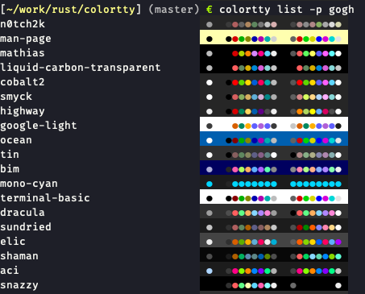

# colortty

colortty is a utility to generate color schemes for [alacritty](https://github.com/jwilm/alacritty). It also supports the following conversions:

- iTerm 2 -> alacritty
- [mintty](https://github.com/mintty/mintty) -> alacritty
- [Gogh](https://github.com/Gogh-Co/Gogh) -> alacritty



## Installation

```sh
cargo install colortty
```

## Usage

```sh
colortty - color scheme converter for alacritty

USAGE:
    # List color schemes at https://github.com/mbadolato/iTerm2-Color-Schemes
    colortty list
    colortty list -p iterm
    colortty list -u # update cached color schemes

    # List color schemes at https://github.com/Gogh-Co/Gogh
    colortty list -p gogh
    colortty list -p gogh -u # update cached color schemes

    # Get color scheme from https://github.com/mbadolato/iTerm2-Color-Schemes
    colortty get <color scheme name>
    colortty get -p iterm <color scheme name>

    # Get color scheme from https://github.com/Gogh-Co/Gogh
    colortty get -p gogh <color scheme name>

    # Convert with implicit input type
    colortty convert some-color.itermcolors
    colortty convert some-color.minttyrc
    colortty convert some-color.sh

    # Convert with explicit input type
    colortty convert -i iterm some-color-theme
    colortty convert -i mintty some-color-theme
    colortty convert -i gogh some-color-theme

    # Convert stdin (explicit input type is necessary)
    cat some-color-theme | colortty convert -i iterm -
    cat some-color-theme | colortty convert -i mintty -
    cat some-color-theme | colortty convert -i gogh -"
```

## Development

Install:

```sh
cargo install --path .
```

Build:

```sh
cargo build
```

Test:

```sh
cargo test
```

## License

MIT
